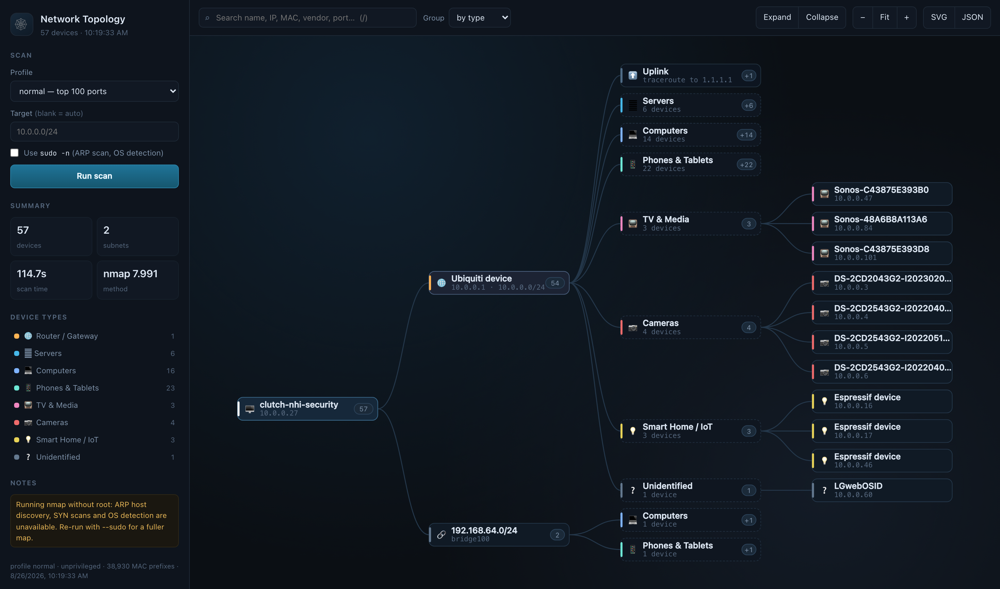

# topology

Scan the local network and render it as an interactive topology tree in the browser.



- **Discovery** via `nmap` when it is installed, with a pure-Node ICMP + TCP + ARP sweep as a fallback.
- **Names** for devices a router does not publish DNS for, using unicast mDNS (5353) and NetBIOS (137) queries.
- **Identification** of what each device probably *is* — router, printer, camera, NAS, phone, IoT — from MAC vendor, hostname, open ports and OS fingerprint, with the reasoning shown in the UI.
- **Uplink** path above the gateway from `traceroute`, so the map shows where your LAN ends.
- **Zero runtime dependencies.** Node 18+ and nothing from npm.

## Quick start

```bash
node src/cli.js            # scan, then serve the map on http://127.0.0.1:4173
```

Or as two steps:

```bash
node src/cli.js scan       # print the tree, write data/latest.json
node src/cli.js serve      # explore the saved scan in the browser
```

`npm start`, `npm run scan` and `npm run serve` are the same commands.

## Why `sudo` matters

Unprivileged `nmap` can only find hosts that answer a TCP connect on a common
port. With root it uses **ARP** on the local segment, which finds essentially
every powered-on device, plus SYN scanning and OS fingerprinting:

```bash
sudo -v                              # prime the sudo timestamp once
node src/cli.js scan --sudo --profile deep
```

The scanner never prompts for a password — it uses `sudo -n` and falls back to
unprivileged mode if that fails, noting it in the warnings. The web UI has a
matching **Use `sudo -n`** checkbox.

## CLI

```
topology scan   [options]    Run a scan, print the tree, save JSON
topology serve  [options]    Serve the interactive web map
topology                     Same as: topology serve --scan
```

| Option | Meaning |
| --- | --- |
| `--target <cidr>` | Subnet or host to scan, repeatable. Default: every local IPv4 subnet that is not a tunnel. |
| `--profile quick` | Host discovery only. Seconds. |
| `--profile normal` | Discovery + top 100 ports. *(default)* |
| `--profile deep` | Discovery + top 500 ports + `-sV` service versions + OS detection. |
| `--sudo` | Run nmap through `sudo -n`. |
| `--no-traceroute` | Skip the uplink trace. |
| `--trace-target <ip>` | Traceroute destination (default `1.1.1.1`). |
| `--max-hosts <n>` | Refuse to auto-scan subnets larger than this (default 4096). |
| `--group category\|vendor\|none` | Grouping for the printed tree. |
| `--out <file>` | JSON destination (default `data/latest.json`). |
| `--json` | Print the model instead of the tree. |
| `--port` / `--host` | Server bind address (default `127.0.0.1:4173`). |
| `--scan` / `--open` | Scan on startup / open a browser. |

## The web map

```
┌───────────────┬──────────────────────────────────────────────┐
│ scan controls │ search · group · expand/collapse · zoom · export │
│ summary       ├──────────────────────────────────────────────┤
│ type legend   │                                              │
│ warnings      │   this machine → gateway → device groups      │
│               │                 └ uplink → hop → Internet     │
└───────────────┴──────────────────────────────────────────────┘
```

- **Click** a node to open its details; a node with children also expands/collapses.
- **Search** matches hostname, IP, MAC, vendor, OS, port number and service name, and prunes the tree to matching branches.
- **Group** by device type, by vendor, or flat.
- **Legend** entries filter the map by device type.
- **Export** the current map as a standalone SVG, or the scan as JSON.
- Keys: `/` search, `f` fit, `e` expand all, `c` collapse all, `Esc` close.

Live scan progress streams to the page over SSE, so you can watch nmap's own
percentage while it works.

### HTTP API

| Route | Purpose |
| --- | --- |
| `GET /api/topology` | The latest scan model (falls back to `data/latest.json`). |
| `POST /api/scan` | Start a scan. Body: `{profile, sudo, targets[]}`. `409` if one is running. |
| `GET /api/events` | SSE stream of `phase` / `progress` / `model` / `error` / `idle` events. |
| `GET /api/health` | Liveness plus whether a scan is in flight. |

The server binds to loopback by default and serves only `web/` plus two
allow-listed modules from `src/lib/`.

## How the tree is built

The tree is what the scan can actually prove, from this machine's vantage point:

```
this machine
└── default gateway (the router that owns your subnet)
    ├── uplink → hop 2 → hop 3 → … → Internet      (from traceroute)
    └── device groups → devices                     (everything on the subnet)
```

Every additional interface with its own subnet — a second NIC, a VM bridge —
becomes another branch. Tunnel interfaces (`utun`, `wg`, `tun`, `ipsec`) are
skipped and reported in the warnings, since scanning through a VPN reaches
someone else's network.

Switch-level topology (which port a device is plugged into) is not discoverable
from a host without SNMP or LLDP access to the switches, so the map does not
invent it.

`src/lib/topology.js` builds the tree and is served to the browser as
`/shared/topology.js`, so the terminal output and the web map come from one
implementation.

## Device identification

Signals are weighted and combined; the winning category and the reasons that
picked it are both stored, and the drawer shows them under **Why this type**.

| Signal | Example |
| --- | --- |
| Default gateway | → Router, high confidence |
| MAC vendor | `Hikvision` → camera, `Espressif` → IoT, `Synology` → NAS |
| Hostname | `Tals-iPhone.local` → phone, `HP-LaserJet` → printer |
| Open ports | 631/9100 → printer, 554 → camera, 8009 → Chromecast, 1400 → Sonos |
| OS fingerprint | `Windows`, `embedded`, `Linux` |

MAC vendors come from nmap's `nmap-mac-prefixes` database (~52k prefixes) when
nmap is installed, otherwise from a small built-in table. Locally-administered
MACs are reported as *randomized* rather than guessed at — modern phones and
laptops rotate them per network.

Names are resolved from three sources, best first: mDNS, NetBIOS, reverse DNS.
The `Name via` field in the drawer says which one answered.

## Project layout

```
src/cli.js            argument parsing, terminal tree, entry point
src/server.js         static server + JSON API + SSE progress
src/scan/index.js     the pipeline: survey → discover → probe → enrich → tree
src/scan/nmap.js      nmap driver and XML result parsing
src/scan/pingsweep.js dependency-free fallback scanner
src/lib/topology.js   flat model → tree (shared with the browser)
src/lib/classify.js   device-type inference (shared with the browser)
src/lib/names.js      mDNS / NetBIOS / reverse-DNS name resolution
src/lib/oui.js        MAC → vendor
src/lib/net.js        interfaces, routes, CIDR math
src/lib/xml.js        minimal XML parser for nmap output
web/                  the map UI (vanilla ESM, no build step)
data/latest.json      most recent scan
```

## Troubleshooting

**Few devices found.** Run with `--sudo` — unprivileged discovery misses
anything that ignores TCP connects. Wireless clients that are asleep also stay
invisible until they talk again; the ARP cache picks them up on the next scan.

**No hostnames.** Most consumer routers publish no PTR records. mDNS and
NetBIOS fill the gap, but some devices answer neither. A device with no name is
still fully identified by MAC vendor and ports.

**Everything lands in "Unidentified".** That is the honest answer for a `quick`
scan, which never looks at ports. Use `normal` or `deep`.

**A scan seems stuck.** Progress is reported per phase in the sidebar and the
terminal. `nmap`'s own ETA is shown during discovery and probing; a `/24` at the
`deep` profile legitimately takes several minutes.

## Scope and consent

Scan networks you own or are authorised to test. Discovery here is ordinary ARP,
ICMP and TCP traffic — nothing exotic — but it is still traffic on someone's
network, and a port scan is visible to any IDS worth its name. Tunnel interfaces
are skipped by default for exactly this reason.
